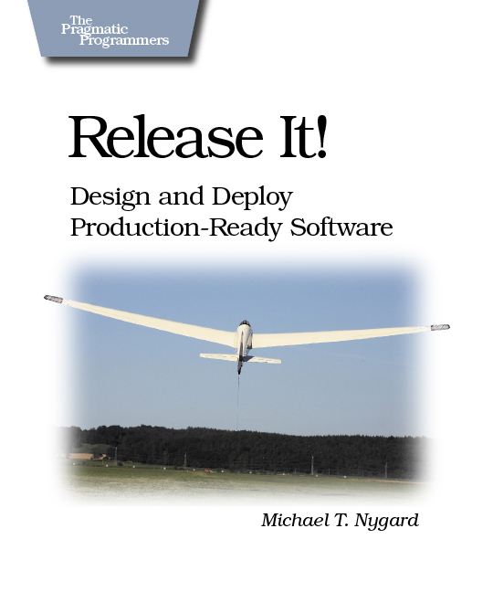
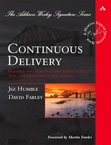

% Designing and Developing Software for Operations
% Will Thames (@willthames)
% 25 July 2014

# Introduction

## Overview

* Discoverability
* Configurability
* Observability
* Resiliency
* Further reading

## Scope
> * Mean Time between Failures (MTBF) &mdash; not so much of this
> * Mean Time to Recovery (MTTR) &mdash; more of this
> * With some emphasis on software delivery

Getting individual applications right within a complex 
distributed system so that applications are operable

## Setting the scene

* 2+ years at Suncorp (2012&ndash;)
* ~8 years at Betfair (2003&ndash;2011)

## A little about Betfair

* Betting exchange &mdash; the complicated bit is matching
  gamblers on both sides of the bet.
* I left in 2011. Much will have changed.
* 150+ applications, not that many of which &lsquo;looked&rsquo; the same
* 1000s of transactions per second, all of which
  were supposed to complete in less than a second
* 1000s of servers across multiple DCs

Genuinely 24x7, highly transactional environment
with low tolerance for downtime.

## A terrible weekend

Microservices have to be carefully considered.

A set of cascading failures across a suite of
microservices contributed to doing 30+ hours of oncall
in a single weekend.

. . .

We came up with a checklist of operational 
requirements, dozens of which were failing on each 
service.

This is a distillation of learnings from that time!

## And Suncorp
The applications I support are typically provided by third
parties, and so making them more supportable is hard.
But that&rsquo;s what support tickets are for.

. . .

Or public education&hellip;

# Discoverability

## Standards

## Adages

> * Comment your code for the poor unfortunate person who
    ends up reading it in six months time &mdash; it could be you.
> * Design your software for the poor unfortunate person who
    gets called up at 3am. In a devops world it could be you.

## Standards

No support team should have to guess how software is set up.
Have organisational standards that declare:

> * How software is installed (chef, puppet, ansible, salt, cfengine &mdash; just pick one)
> * Where logs live
> * Where configuration comes from, and what the current configuration is
> * How to stop, start, interrogate status of an app

# Configurability

## Configuration Management
> * Terrible: configuration as part of the deployable
> * Good: separate configuration files read at startup
> * Best if well managed (change auditing etc): runtime configuration
    read from a service (e.g. etcd, zookeeper) or DB

## The configuration monolith
> * Bad: one giant configuration file containing everything from
    license keys and authentication tokens to configuration.
> * Worse: these configuration files updated by user interaction at runtime.
> * Better: Configuration files tied to a particular purpose,
    in an easily templated fashion (think linux conf.d structures)

----------------------
Special mention for this beauty buried deep in a file that
changes every version:

    <!-- Uncomment this to enable this particularly useful configuration
      <some>
        <arbitrary>
          <xml>Make stuff work here</xml>
        </arbitrary>
      </some>
    -->

Particularly difficult to template or remove specific lines
in a way that works across releases

# Observability

## Logging

* Configure log rotation on a schedule
* Log in an unchanging timezone (UTC, or Australia/Brisbane rather
  than Australia/Sydney)
* Logs should have a single specific purpose

## Application logs

* Exceptions should be exceptional. `AuthenticationException` when a
  user mistypes their password is NOT exceptional &mdash; 
  don&rsquo;t log a stack trace for it &mdash; put it in an audit log 
  if need be!
* Know your log parsing tools &mdash; writing information as key=value
  pairs will save you from having to write custom parsers.
* Transaction IDs are great for tying together multiple logs, especially if
  you can get them in your access log too.

## Access logs

* Access logs should contain the obvious (URL, status code, timestamp etc)
* Less out of the box, log: response time, user ID and *actual* IP address
  &mdash; i.e. if it comes through a proxy or load balancer, log
  `X-Forwarded-For` or similar, not the intermediary IP.
* Be careful of timeouts &mdash; not all long running requests make it to the
  access logs.

. . .

* If you can&rsquo;t use a widely-used access log format, make your access log
  format standard across your organisation.

## Health status pages

* Health status pages can be used by loadbalancers and humans
* Make your loadbalancer checks be as complete as possible
  (test connections to critical integration points)
* Make your loadbalancer health checks be as quick as possible
* Have a separate more verbose healthcheck page if need be
  containing status of DB connections, queue lengths, request counts etc.
* Allow the healthcheck to recalculate regularly(!!)

# Resiliency

## Fail safely
* Fail gracefully where possible. Know your failure scenarios!
* Fail fast &mdash; don&rsquo;t block threads or other scarce 
  resources for long periods

## Recovery
* When a healthcheck fails due to a dependency failure, ensure
  that that dependency recovering means that the healthcheck to recover
* Ensure a service can start even in the absence of any dependencies.
  It might not be healthy (and if not should fail its healthchecks)
  But it should recover when the dependency recovers.

# Further Reading

## Release It
Michael Nygaard wrote the book on making software operable.

## Continuous Delivery
Jez Humble and Dave Farley regularly makes the point that
configuration management is one of the foundations of
Continuous Delivery and have some great advice:

## Practical Microservices

&ldquo;Doing microservices right&rdquo; talks about how to avoid some of 
the common pitfalls of microservices
[http://www.slideshare.net/spnewman/practical-microservices-yow-2013](http://www.slideshare.net/spnewman/practical-microservices-yow-2013) 

# Questions?

# Slides are at [http://willthames.github.io/devopsdays2014](http://willthames.github.io/devopsdays2014)
